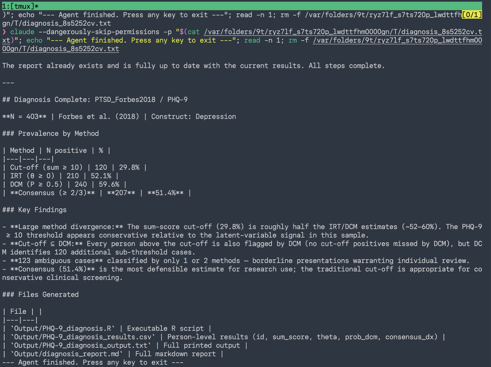
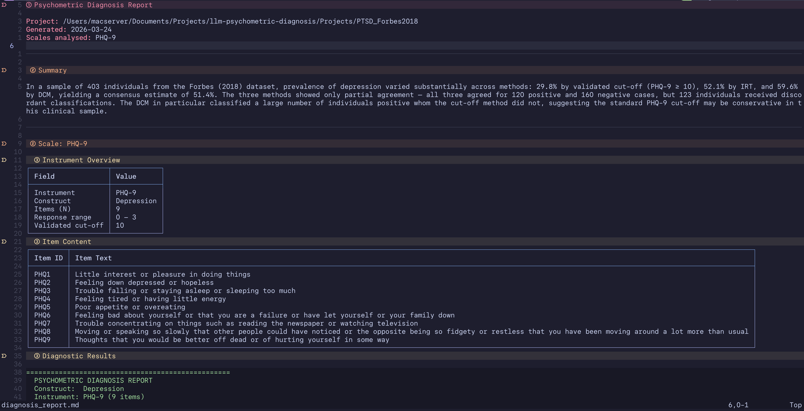

# LLM-Assisted Psychometric Diagnosis

A framework for automatic psychometric diagnosis using a Claude Code agent. Given item-level response data from any psychological scale, the agent applies three complementary methods — sum score cut-off, Item Response Theory (IRT), and Diagnostic Classification Models (DCM) — and generates a structured report with clinical interpretation.

---

## Demo

Running `diagnosis run Projects/PTSD_Forbes2018` spawns a tmux session where the Claude agent executes the full pipeline and streams results directly to the terminal:



The agent reports prevalence by all three methods, flags key findings (e.g. method divergence, ambiguous cases), and lists every generated output file.

The agent writes a structured `diagnosis_report.md` to `Output/` with instrument overview, item content, diagnostic results, and plain-language interpretation:



---

## Setup

**Requirements:** [Claude Code](https://claude.ai/code), tmux, R ≥ 4.0, Python ≥ 3.10.

**macOS**
```bash
brew install pipx
pipx ensurepath
```

**Linux**
```bash
python3 -m pip install --user pipx
python3 -m pipx ensurepath
```

**Windows**
```powershell
python -m pip install --user pipx
python -m pipx ensurepath
```

Then clone and install:

```bash
git clone https://github.com/JihongZ/llm-psychometric-diagnosis
cd llm-psychometric-diagnosis
pipx install -e .
```

Verify the install:

```bash
diagnosis --help
```

Install R (if not already installed) — download from **https://cran.r-project.org**:

| Platform | Command |
|---|---|
| macOS | `brew install r` |
| Linux (Debian/Ubuntu) | `sudo apt install r-base` |
| Windows | Download and run the installer from CRAN |

Then install the required R packages:

```r
install.packages(c("mirt", "CDM"))
```

---

## Commands

| Command | Description |
|---|---|
| `diagnosis run <folder>` | Run the full pipeline (attaches to tmux session) |
| `diagnosis run <folder> --clear` | Delete `Output/` then re-run |
| `diagnosis run <folder> --no-attach` | Run in background without attaching |
| `diagnosis attach <name>` | Re-attach to a running session |
| `diagnosis ls` | List all active diagnosis sessions |
| `diagnosis kill <name>` | Stop a running session |
| `diagnosis version` | Show installed version |

`<folder>` is the path to your project folder (e.g. `Projects/PTSD_Forbes2018`).
`<name>` is just the folder name, not the full path (e.g. `PTSD_Forbes2018`).

---

## How It Works

```
project_folder/
  items.csv             ← item metadata you provide
  prepare_responses.R   ← data loading script (agent generates if missing)
  responses.csv         ← auto-generated by prepare_responses.R
  Output/               ← auto-generated by the agent
    [scale]_diagnosis.R
    [scale]_diagnosis_results.csv
    [scale]_diagnosis_output.txt
    diagnosis_report.md
```

When you run `diagnosis run <folder>`, the agent will:

1. Generate `prepare_responses.R` if it does not exist, then run it to produce `responses.csv`
2. Validate that item IDs in `items.csv` match columns in `responses.csv`
3. Generate a self-contained `[scale]_diagnosis.R` for each scale found in `items.csv`
4. Execute each R script via `Rscript`
5. Write `Output/diagnosis_report.md` with results and plain-language interpretation

The agent runs inside a **tmux session** (`diagnosis-{project}`) so you can watch it work in real-time, detach and re-attach, or run it in the background.

---

## Preparing a New Project

Create a folder under `Projects/` with two files:

### `items.csv`

One row per item. Required columns:

| Column | Description |
|---|---|
| `item_id` | Unique ID matching column names in `responses.csv` (e.g. `PCL1`) |
| `item_text` | Full item wording as shown to respondents |
| `scale` | Scale name used to group items and label outputs (e.g. `PCL-5`) |
| `cutoff` | Validated sum-score cut-off for this scale (repeat for all rows in the scale) |
| `response_min` | Minimum response value (e.g. `0`) |
| `response_max` | Maximum response value (e.g. `4`) |

```csv
item_id,item_text,scale,cutoff,response_min,response_max
PCL1,Repeated disturbing and unwanted memories of the stressful experience,PCL-5,33,0,4
PCL2,Repeated disturbing dreams of the stressful experience,PCL-5,33,0,4
...
```

### `prepare_responses.R` (optional)

A project-specific script that loads raw data and writes `responses.csv`. If missing, the agent generates a template. The script must produce a CSV with rows = persons and columns = `item_id` values from `items.csv`.

```r
raw       <- read.csv("path/to/raw_data.csv")
items     <- read.csv("Projects/your_study/items.csv")
responses <- raw[, items$item_id]
write.csv(responses, "Projects/your_study/responses.csv", row.names = FALSE)
```

Then run:

```bash
diagnosis run Projects/your_study
```

---

## Diagnostic Methods

### Method A — Sum Score Cut-off
Sums item responses per person and compares to a validated clinical threshold. Fast and interpretable; requires a published cut-off for the instrument.

### Method B — Item Response Theory (IRT)
Fits a Graded Response Model (polytomous items) or 2PL model (binary items) using `mirt`. Estimates a latent trait score (θ) per person with standard errors. Classifies persons above a θ threshold (default: population mean, θ = 0).

### Method C — Diagnostic Classification Model (DCM)
Fits a log-linear cognitive diagnosis model (LCDM/GDM) using `CDM`. Returns a posterior probability of class membership per person. Classifies persons with P(diagnosed) ≥ 0.5.

### Consensus Diagnosis
A person is flagged as diagnosed if **at least 2 of 3 methods** agree. Persons where only 1 method flags them are marked ambiguous and highlighted in the report.

---

## Example: Depression Screening (Forbes 2018)

`Projects/PTSD_Forbes2018/` demonstrates the workflow using publicly available PHQ-9 data from [Forbes et al. (2018)](https://osf.io/6fk3v/).

```bash
diagnosis run Projects/PTSD_Forbes2018
```

`prepare_responses.R` downloads the raw data from OSF automatically on first run. All output is written to `Projects/PTSD_Forbes2018/Output/`.

---

## Limitations

- **DCM:** Only the general diagnostic model (`CDM::gdm`) is currently supported. More specialised DCMs (DINA, DINO, GDINA) and multidimensional attribute structures are not yet implemented.
- **IRT:** Limited to the Graded Response Model (`mirt`, `itemtype = "graded"`). Other IRT models (2PL, 3PL, GPCM, nominal) are not automatically selected. The model also requires **complete responses** — items with missing data will cause an error; imputation must be handled in `prepare_responses.R` before running the pipeline.

---

## How the Agent Works

`diagnosis run` is a thin Python wrapper (built with [Typer](https://typer.tiangolo.com/)) that:

1. Validates the project folder (`items.csv` must exist)
2. Loads skill files bundled with the package from `diagnosis/skills/`
3. Builds a prompt combining the agent workflow and R function definitions
4. Creates a tmux session and runs `claude --dangerously-skip-permissions -p "<prompt>"` inside it
5. Attaches your terminal to the session

The agent reads files, generates and executes R scripts, and writes `Output/diagnosis_report.md`.

To customise agent behaviour, edit `diagnosis/skills/diagnosis.md` (workflow) or `diagnosis/skills/psychometric-diagnosis.md` (R functions).

---

## Project Structure

```
.
├── diagnosis/                           # Python package (pipx install -e .)
│   ├── cli.py                           # Typer CLI: run / attach / kill / ls / version
│   ├── tmux.py                          # tmux session management
│   ├── skill_loader.py                  # loads bundled skill files
│   ├── __init__.py
│   ├── __main__.py
│   └── skills/
│       ├── diagnosis.md                 # agent workflow definition
│       └── psychometric-diagnosis.md   # R function definitions
├── pyproject.toml                       # package metadata and entry point
├── .claude/
│   └── commands/                        # same skills exposed as Claude Code slash commands
│       ├── diagnosis.md
│       └── psychometric-diagnosis.md
├── Projects/
│   └── PTSD_Forbes2018/                 # example project
│       ├── items.csv                    # item metadata (scale, cutoff, response range)
│       ├── prepare_responses.R          # downloads data from OSF and writes responses.csv
│       └── Output/                      # auto-generated — not tracked by git
│           ├── PHQ-9_diagnosis.R
│           ├── PHQ-9_diagnosis_results.csv
│           ├── PHQ-9_diagnosis_output.txt
│           └── diagnosis_report.md
├── Screenshots/
│   ├── Diagnosis_PTSD.png               # demo: tmux session with agent running
│   └── Diagnosis_Report.png             # demo: generated diagnosis_report.md
└── README.md
```
